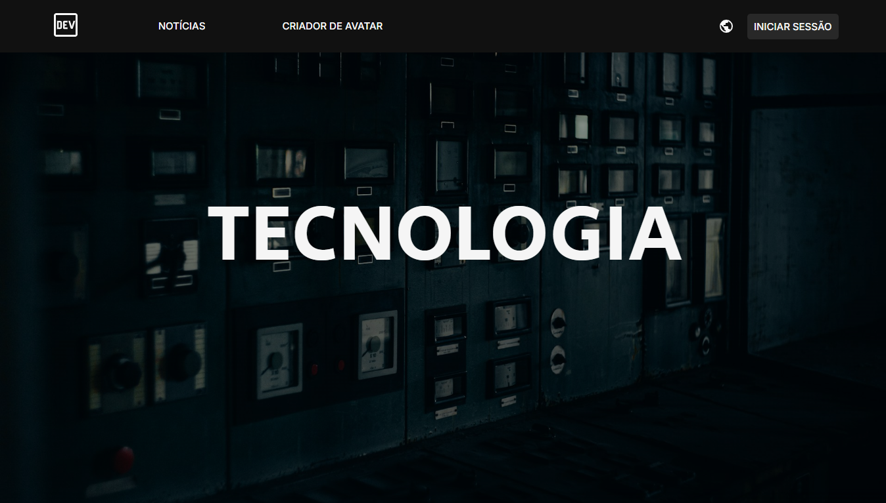

# ⚙️ Landing Page Steampunk

Landing page desenvolvida com uma estética **Steampunk**, inspirada no design e na experiência visual do site oficial de [Arcane](https://www.arcane.com/pt-br/).

O projeto foi desenvolvido com foco em **estudo e prática de desenvolvimento Front-end**, explorando principalmente a criação de interfaces responsivas, estilização com CSS e interações utilizando JavaScript.

## 📸 Preview

  

    
  

## 🚀 Tecnologias utilizadas

- **HTML** — estrutura e semântica da página
- **CSS** — estilização, layout, responsividade e animações
- **JavaScript** — interações e funcionalidades da página

## 🎯 Objetivos do projeto

Este projeto foi desenvolvido para praticar e aprimorar conhecimentos em:

- Estruturação de páginas com HTML
- Criação de layouts com CSS
- Responsividade para diferentes tamanhos de tela
- Animações e efeitos visuais
- Manipulação do DOM com JavaScript
- Organização de arquivos e código em um projeto Front-end
  
 

> ⚠️ Este é um projeto desenvolvido para fins de **estudo e prática**, tendo como referência visual o site oficial de Arcane. Os elementos visuais e a temática foram adaptados para uma proposta Steampunk.
